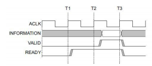
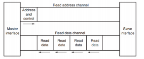
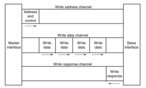

# FPGA 0_FPGA 概述

## 1. FPGA简介

FPGA(Field Programmable Gate Array，现场可编程门阵列)，属于可编程逻辑器件(PLD)的一种。

- 集成电路的分类

专用集成电路(ASIC)用于专用的逻辑功能，分为全定制和半定制电路，全定制电路的结构是固定的，不可由用户更改，半定制电路可以由用户编程更改电路结构，实现不同的逻辑功能。

- 集成电路的演变

1. 可编程逻辑阵列PLA 

> - 用PLA实现逻辑函数的基本原理是基于函数的最简与或表达式；
> - 与阵列可编程，无需产生所有的最小项，电路规模小；
> - 或阵列可编程，电路实现灵活；
> - 由于需要逻辑函数的最简与-或表达式，涉及的软件算法比较复杂，特别是对于多输出逻辑函数；
> - 与、或两级可编程，编程难度较大，一般由厂家完成。

2. 可编程只读存储器PROM

> - PROM是以逻辑函数的最小项表达式为依据的；
> - 与阵列固定，产生输入变量的全部最小项；
> - 器件的规模随着输入信号数量$n$的增加呈$2^n$指数级增长；
> - 组合型结构，无触发器。

3. 可编程阵列逻辑PAL

   

> - 与阵列可编程，或阵列固定，输出端为固定个数与项的或；
> - 通常PAL输出端的与项个数达到8个，满足大多数逻辑函数的设计需求；
> - 易于制造，成本低。

4. 通用阵列逻辑GAL

在PAL的基础上，GAL的输出电路部分增设了可编程的输出逻辑宏单元(OLMC)，通过编程可将OLMC设置为不同的工作状态 ， 从而实现PAL的所有输出结构， 产生组合、时序逻辑电路出。

5. 复杂可编程逻辑器件CPLD

CPLD是在PAL 、GAL基础上发展起来的阵列型PLD，CPLD 集成度远远高于PAL和GAL，用来设计数字系统，体积小、功耗低、可靠性高。

CPLD由若干个可编程逻辑宏单元(LMC)组成，LMC内部主要包括与阵列、或阵列、可编程触发器和多路选择器等，能独立地配置为时序或组合工作方式；

I/O控制块：I/O 单元是 CPLD 外部封装引脚和内部逻辑间的接口。每个 I/O 单元对应一个封装引脚，对 I/O 单元编程，可将引脚定义为输入、输出和双向功能；

内部连线矩阵：可编程内部连线的作用是实现逻辑块与逻辑块之间、逻辑块与I/O块之间以及全局信号到逻辑块和I/O块之间的连接；

CPLD的计算部件LAB与PLD一样，也是基于与阵列和或阵列实现的。

6. 现场可编程门阵列FPGA

- CLB是FPGA的基本逻辑单元，所有的逻辑功能都是在CLB中完成的。
- CLB主要由逻辑函数发生器、触发器、数据选择器等电路组成。逻辑函数发生器主要由查找表LUT构成。

## 2. ZYNQ简介

ZYNQ，即 Zynq-7000 All Programmable Soc，是由 AMD Xilinx 推出的全可编程片上系统。

ZYNQ 包含 PS(Processing System，处理系统) 和 PL (Program Logic，可编程逻辑)。PS 即为 Arm（Cortex-A9内核）处理器，PL 即为 FPGA。

PS 和 PL 之间通过 AXI 接口进行连接，AXI 全称 Advanced eXtensible Interface，是 Xilinx 从 6 系列的 FPGA 开始引入的一个接口协议，主要描述了主设备和从设备之间的数据传输方式。在 ZYNQ 中继续使用，版本是 AXI4。

AXI 协议主要描述了主设备和从设备之间的数据传输方式，主设备和从设备之间通过握手信号建立连接。当从设备准备好接收数据时，会发出 READY 信号。当主设备的数据准备好时，会发出和维持 VALID 信号，表示数据有效。数据只有在 VALID 和 READY 信号都有效的时候才开始传输。当这两个信号持续保持有效，主设备会继续传输下一个数据。主设备可以撤销 VALID 信号，或者从设备撤销 READY 信号终止传输。AXI 的协议如图，T2 时，从设备的 READY 信号有效，T3 时主设备的 VILID 信号有效，数据传输开始。

在 ZYNQ 中，支持 AXI-Lite，AXI4 和 AXI-Stream 三种总线。

> **AXI4-Lite**
>
> 具有轻量级，结构简单的特点，适合小批量数据、简单控制场合。不支持批量传输，读写时一次只能读写一个字（32bit）。主要用于访问一些低速外设和外设的控制。
>
> **AXI4**
>
> 接口和 AXI-Lite 差不多，只是增加了一项功能就是批量传输，可以连续对一片地址进行一次性读写。也就是说具有数据读写的 burst 功能。上面两种均采用内存映射控制方式，即 ARM 将用户自定义 IP 编入某一地址进行访问，读写时就像在读写自己的片内 RAM，编程也很方便，开发难度较低。代价就是资源占用过多，需要额外的读地址线、写地址线、读数据线、写数据线、写应答线这些信号线。
>
> **AXI4-Stream**
>
> 这是一种连续流接口，不需要地址线（很像 FIFO，一直读或一直写就行）。对于这类 IP，ARM 不能通过上面的内存映射方式控制（FIFO 根本没有地址的概念），必须有一个转换装置，例如 AXI-DMA 模块来实现内存映射到流式接口的转换。AXI-Stream 适用的场合有很多：视频流处理；通信协议转换；数字信号处理；无线通信等。其本质都是针对数值流构建的数据通路，从信源（例如 ARM 内存、DMA、无线接收前端等）到信宿（例如 HDMI 显示器、高速 AD 音频输出，等）构建起连续的数据流。这种接口适合做实时信号处理。

AXI4 和 AXI4-Lite 接口包含 5 个不同的通道：

> Read Address Channel
> Write Address Channel
> Read Data Channel
> Write Data Channel
> Write Response Channel
>
> 
>
> 

在 ZYNQ 芯片内部用硬件实现了 AXI 总线协议，包括 9 个物理接口，分别为 AXI-GP0 ~ AXIGP3，AXI-HP0 ~ AXI-HP3，AXI-ACP 接口。

> - AXI_ACP 接口，是 ARM 多核架构下定义的一种接口，中文翻译为加速器一致性端口，用来管理 DMA 之类的不带缓存的 AXI 外设，PS 端是 Slave 接口。
> - AXI_HP 接口，是高性能/带宽的 AXI3.0 标准的接口，总共有四个，PL 模块作为主设备连接。主要用于 PL 访问 PS 上的存储器（DDR 和 On-Chip RAM）。
> - AXI_GP 接口，是通用的 AXI 接口，总共有四个，包括两个 32 位主设备接口和两个 32 位从设备接口。

常用的 AXI 接口 IP 的功能介绍：

> - AXI-DMA：实现从 PS 内存到 PL 高速传输高速通道 AXI-HP ---- AXI-Stream 的转换。
> - AXI-FIFO-MM2S：实现从 PS 内存到 PL 通用传输通道 AXI-GP ----- AXI-Stream 的转换。
> - AXI-Datamover：实现从 PS 内存到 PL 高速传输高速通道 AXI-HP ---- AXI-Stream 的转换，只不过这次是完全由 PL 控制的，PS 是完全被动的。
> - AXI-VDMA：实现从 PS 内存到 PL 高速传输高速通道 AXI-HP ---- AXI-Stream 的转换，只不过是专门针对视频、图像等二维数据的。
> - AXI-CDMA：这个是由 PL 完成的将数据从内存的一个位置搬移到另一个位置，无需 CPU 来插手。

用户其实不需要对 AXI 时序了解太多（除非确实遇到问题），因为 Xilinx 已经将和 AXI 时序有关的细节都封装起来，用户只需要关注自己的逻辑实现即可。

由于 ZYNQ 将 CPU 与 FPGA 集成在了一起，开发人员既需要设计 ARM 的操作系统应用程序和设备的驱动程序，又需要设计 FPGA 部分的硬件逻辑设计。开发中既要了解 Linux 操作系统，系统的构架，也需要搭建一个 FPGA 和 ARM 系统之间的硬件设计平台。所以 ZYNQ 的开发是需要软件人员和硬件硬件人员协同设计并开发的。这既是 ZYNQ 开发中所谓的"软硬件协同设计”。
ZYNQ 系统的硬件系统和软件系统的设计和开发需要用到一下的开发环境和调试工具：Xilinx Vivado。

Vivado 设计套件实现 FPGA 部分的设计和开发，管脚和时序的约束，编译和仿真，实现RTL 到比特流的设计流程。Vivado 并不是 ISE 设计套件的简单升级，而是一个全新的设计套件。它替代了 ISE 设计套件的所有重要工具，比如 Project Navigator、Xilinx Synthesis Technology、Implementation、CORE Generator、Constraint、Simulator、ChipscopeAnalyzer、FPGA Editor 等设计工具。

Xilinx SDK（Software Development Kit）， SDK 是 Xilinx 软件开发套件(SDK),在 Vivado 硬件系统的基础上，系统会自动配置一些重要参数，其中包括工具和库路径、编译器选项、JTAG 和闪存设置，调试器连接已经裸机板支持包(BSP)。SDK 也为所有支持的 Xilinx IP 硬核提供了驱动程序。SDK 支持 IP 硬核（FPGA 上）和处理器软件协同调试，我们可以使用高级 C 或 C++语言来开发和调试 ARM 和 FPGA 系统，测试硬件系统是否工作正常。SDK 软件也是 Vivado 软件自带的，无需单独安装。

ZYNQ 的开发也是先硬件后软件的方法。具体流程如下：

> 1) 在 Vivado 上新建工程，增加一个嵌入式的源文件。
> 2) 在 Vivado 里添加和配置 PS 和 PL 部分基本的外设，或需要添加自定义的外设。
> 3) 在 Vivado 里生成顶层 HDL 文件，并添加约束文件。再编译生成比特流文件（*.bit）。
> 4) 导出硬件信息到 SDK 软件开发环境，在 SDK 环境里可以编写一些调试软件验证硬件和软件，结合比特流文件单独调试 ZYNQ 系统。
> 5) 在 SDK 里生成 FSBL 文件。
> 6) 在 VMware 虚拟机里生成 u-boot.elf、 bootloader 镜像。
> 7) 在 SDK 里通过 FSBL 文件, 比特流文件 system.bit 和 u-boot.elf 文件生成一个 BOOT.bin 文件。
> 8) 在 VMware 里生成 Ubuntu 的内核镜像文件 Zimage 和 Ubuntu 的根文件系统。另外还需要要对 FPGA 自定义的 IP 编写驱动。
> 9) 把 BOOT、内核、设备树、根文件系统文件放入到 SD 卡中，启动开发板电源，Linux 操作系统会从 SD 卡里启动。

