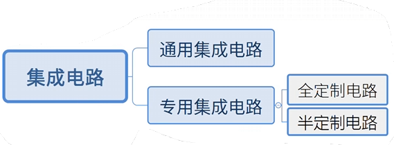
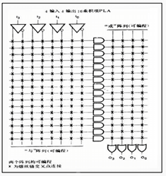
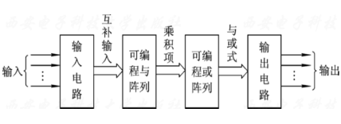
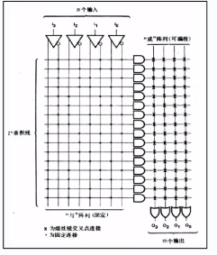
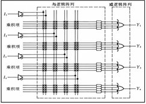
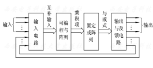
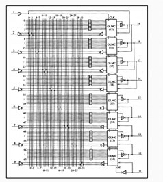
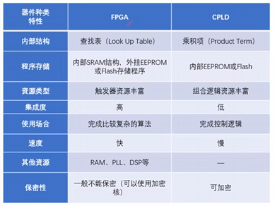

# FPGA 0_FPGA 概述

## 1. FPGA简介

FPGA(Field Programmable Gate Array，现场可编程门阵列)，属于可编程逻辑器件(PLD)的一种。

- 集成电路的分类

专用集成电路(ASIC)用于专用的逻辑功能，分为全定制和半定制电路，全定制电路的结构是固定的，不可由用户更改，半定制电路可以由用户编程更改电路结构，实现不同的逻辑功能。

- 集成电路的演变

1. 可编程逻辑阵列PLA 

> - 用PLA实现逻辑函数的基本原理是基于函数的最简与或表达式；
> - 与阵列可编程，无需产生所有的最小项，电路规模小；
> - 或阵列可编程，电路实现灵活；
> - 由于需要逻辑函数的最简与-或表达式，涉及的软件算法比较复杂，特别是对于多输出逻辑函数；
> - 与、或两级可编程，编程难度较大，一般由厂家完成。

2. 可编程只读存储器PROM

> - PROM是以逻辑函数的最小项表达式为依据的；
> - 与阵列固定，产生输入变量的全部最小项；
> - 器件的规模随着输入信号数量$n$的增加呈$2^n$指数级增长；
> - 组合型结构，无触发器。

3. 可编程阵列逻辑PAL

   

> - 与阵列可编程，或阵列固定，输出端为固定个数与项的或；
> - 通常PAL输出端的与项个数达到8个，满足大多数逻辑函数的设计需求；
> - 易于制造，成本低。

4. 通用阵列逻辑GAL

在PAL的基础上，GAL的输出电路部分增设了可编程的输出逻辑宏单元(OLMC)，通过编程可将OLMC设置为不同的工作状态 ， 从而实现PAL的所有输出结构， 产生组合、时序逻辑电路出。

5. 复杂可编程逻辑器件CPLD

CPLD是在PAL 、GAL基础上发展起来的阵列型PLD，CPLD 集成度远远高于PAL和GAL，用来设计数字系统，体积小、功耗低、可靠性高。

CPLD由若干个可编程逻辑宏单元(LMC)组成，LMC内部主要包括与阵列、或阵列、可编程触发器和多路选择器等，能独立地配置为时序或组合工作方式；

I/O控制块：I/O 单元是 CPLD 外部封装引脚和内部逻辑间的接口。每个 I/O 单元对应一个封装引脚，对 I/O 单元编程，可将引脚定义为输入、输出和双向功能；

内部连线矩阵：可编程内部连线的作用是实现逻辑块与逻辑块之间、逻辑块与I/O块之间以及全局信号到逻辑块和I/O块之间的连接；

CPLD的计算部件LAB与PLD一样，也是基于与阵列和或阵列实现的。

6. 现场可编程门阵列FPGA

- CLB是FPGA的基本逻辑单元，所有的逻辑功能都是在CLB中完成的。
- CLB主要由逻辑函数发生器、触发器、数据选择器等电路组成。逻辑函数发生器主要由查找表LUT构成。

