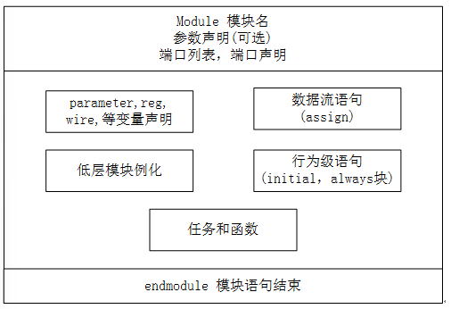

# FPGA 2_Verilog 语言

硬件描述语言（ hardware description language , HDL ）是一种用形式化方法描述逻辑电路
和系统的语言。利用这种语言，逻辑电路系统的设计可以从上层到下层（从抽象到具体）逐
层描述自己的设计思想，用一系列分层次的模块来表示极其复杂的逻辑系统。然后，利用电
子设计自动化（ EDA ）工具，逐层进行仿真验证，再把其中需要变为实际电路的模块组合，
经过自动综合工具转换到门级电路网表。接下来，再用专用集成电路（ ASIC ）或现场可编
程门阵列（ FPGA ）自动布局布线工具，把网表转换为要实现的具体电路布线结构。据统计，目前在美国硅谷约有 90％以上的 ASIC 和 FPGA 采用硬件描述语言进行设计。

硬件描述语言 HDL 发展至今已有 30 多年的历史，出现了上百种硬件描述语言，对设计自动化起到了极大的促进和推动作用。现在应用广泛的硬件描述语言， 例如 VHDL 和 Verilog HDL 先后成为 IEEE 标准。

##  Verilog 基本语法

### 1. 基本语法元素

#### 间隔符

Verilog 的间隔符主要起分隔文本的作用，可以使文本错落有致，便于阅读与修改。间隔符包括空格符（`\b`）、TAB 键（`\t`）、换行符（`\n`）及换页符。

#### 注释符

注释只是为了改善程序的可读性，在编译时不起作用。

- 多行注释符： `/* --- */`；
- 单行注释符：以`//`开始，到行尾结束为注释文字。

#### 标识符和关键词

- 标识符：给对象（如模块名、电路的输入与输出端口、变量等）取名所用的字符串。**以英文字母或下划线开始**，如`clk`、`counter8`、`_net`、`bus_A` 。

- 关键词：是 Verilog 语言本身规定的特殊字符串，用来定义语言的结构。例如，`module`、`endmodule`、`input`、`output`、`wire`、`reg`、`and` 等都是关键词。**关键词都是小写，关键词不能作为标识符使用。**

#### 逻辑值集合

为了表示数字逻辑电路的逻辑状态，Verilog 语言规定了 4 种基本的逻辑值。分别为 `0`— 逻辑假，`1` — 逻辑真，`x` 或 `X` — 不确定，`z` 或 `Z` — 高阻态。

#### 常量

Verilog 语言的常量包括***整数型常量***和***实数型常量***两大类型。

- 整数型常量

  > 1. 十进制数表示，用于表示有符号常量，例如 30，-2 等；
  > 2. 带基数形式的表示，格式为：`<+/-><位宽>'<基数符号><数值>`，例如 `4'b1011`、`5'o37`、`8'hE3`，`8'b1001_0011` 等。数字中的下划线可以增强可读性。

- 实数型常量

  > 1. 十进制数表示，例如 `0.3`、`4.0`、`3.86`；
  > 2. 科学记数法表示，例如`3.2e2`、`4E-3`。

- 符号型常量

Verilog 允许用参数定义语句定义一个标识符来代表一个常量，称为符号常量。

```verilog
parameter 参数名 1＝常量表达式 1，参数名 2＝常量表达式 2;
```

#### 字符串

字符串是`" "`内的字符序列。

### 2. 基本数据类型

Verilog 包括线网类型和寄存器类型。

#### 线网类型

线网类型包括`wire`和`tri`两种，用于对结构化器件之间的物理连线的建模，如器件的管脚，内部器件的输出等。

1. 线网类型代表物理连接线，不存储逻辑值。
2. 线网类型必须通过器件进行驱动，通常由`assign`语句进行赋值。

```verilog
assign A = B^C;
```

3. `wire`类型的信号没有被驱动时，缺省值为`Z`;
4. 信号未定义数据类型时，缺省为`wire`类型。
5. `wire`和`tri`区别在于定义三态的线网。

#### 寄存器类型

<font color=LightGreen>1. **`reg`**类型</font>

`reg`是最常用的寄存器类型，寄存器类型通常用于描述触发器和存储单元。

1. 寄存器类型的信号在某种触发机制下分配了一个值，在分配下一个值时保留原值。
2. `always`语句中必须使用`reg`类型的变量进行描述。
3. `reg`类型语法定义如下：

```verilog
// msb 和 lsb 用于定义寄存器的位数，缺省时为1位寄存器
reg [msb:lsb] reg1;

reg cnt;	   // 1 位寄存器
reg [3:0] Sat; // 4 位寄存器
```

<font color=LightGreen>2. `memory`类型</font>

可以用 `memory` 类型来定义 RAM,ROM 等存储器。

```verilog
// m 个 n 位宽度的寄存器
reg [n-1:0] 存储器名[m-1:0];

reg [7:0] ram [255:0];
```

256 也即是存储器的深度，8 为数据宽度。

### 3. 运算符和表达式

#### 算术运算符

`+`(加法运算符)，`-`（减法运算符），`*`(乘法运算符)，`/`（除法运算符），`%`（取模运算符）。

> 1. 算术操作结果的位数长度由最长位数的操作数决定；赋值语句下，算术操作结果的位数长度由操作符左端目标长度决定。
> 2. 如果存在溢出，如果位数不足，则溢出值被丢弃。
> 3. 运算时的中间结果应当取最大操作数的位数决定。

#### 关系运算符

用于表示两个操作数之间的关系，如 `a>b`，`a<b`，多用于判断条件。

> 1. 关系操作的结果为1或者0；
> 2. 如果操作数存在`X`或者`Z`，结果为`X`。

#### 逻辑运算符

`&&`（两个操作数逻辑与），`||`（两个操作数逻辑或），`!`（单个操作数逻辑非）

#### 按位逻辑运算符

`!`（一个操作数非门），`&`（二个操作数与门），`|`（两个操作数或门），`^`（两个操作数异或门），`~^`（两个操作数同或）。

#### 条件运算符

#### 连接运算符

```verilog
{expr1,expr2,...,exprn};
```

将小表达式合并为大表达式。

```verilog
wire [7:0] Dbus;
// 以反转的顺序将低4位赋值给高4位
assign Dbus[7:4] = {Dbus[0],Dbus[1],Dbus[2],Dbus[3]};
// 低4位和高4位交换
assign Dbus = {Dbus[3:0],Dbus[7:4]};
```

### 4. 常用语句

#### 条件语句

```verilog
if(condition_1)
    statement_1;
else if(condition_2)
    statement_2;
else
    statement_3;
```

#### 选择语句

```verilog
case(case_expr)
    condition1     :             true_statement1 ;
    condition2     :             true_statement2 ;
    ……
    default        :             default_statement ;
endcase
```

#### 循环语句

```verilog
while (condition) begin
    …
end
```

> `while` 循环中止条件为 `condition` 为假。如果开始执行到 `while` 循环时 `condition` 已经为假，那么循环语句一次也不会执行。执行语句只有一条时，关键字 `begin` 与 `end` 可以省略。

```verilog
for(initial_assignment; condition ; step_assignment)  begin
    …
end
```

> `initial_assignment` 为初始条件。`condition` 为终止条件，`condition` 为假时，立即跳出循环。`step_assignment` 为改变控制变量的过程赋值语句，通常为增加或减少循环变量计数。

```verilog
repeat (loop_times) begin
    …
end
```

> `repeat` 的功能是执行固定次数的循环，它不能像 `while` 循环那样用一个逻辑表达式来确定循环是否继续执行。`repeat` 循环的次数必须是一个常量、变量或信号。如果循环次数是变量信号，则循环次数是开始执行 `repeat` 循环时变量信号的值。即便执行期间，循环次数代表的变量信号值发生了变化，`repeat` 执行次数也不会改变。

```verilog
forever begin
    …
end
```

> `forever` 语句表示永久循环，不包含任何条件表达式，一旦执行便无限的执行下去，系统函数 `$finish` 可退出 `forever`。

### 5. 基本单元——模块

模块是 Verilog 中基本单元的定义形式，是与外界交互的接口。

模块内部有可选的 5 部分组成，分别是变量声明，数据流语句，行为级语句，低层模块例化及任务和函数。



```verilog
module module_name (port_list) ;
     // Declarations_and_Statements
endmodule
```

1. 端口声明

根据端口的方向，端口类型有 3 种： 输入（`input`），输出（`output`）和双向端口（`inout`）。

- `input`、`inout` 类型不能声明为 `reg` 数据类型，因为 `reg` 类型是用于保存数值的，而输入端口只能反映与其相连的外部信号的变化，不能保存这些信号的值。

- `output` 可以声明为 `wire` 或 `reg` 数据类型。

- 在 Verilog 中，端口隐式的声明为 `wire` 型变量，即当端口具有 `wire` 属性时，不用再次声明端口类型为 `wire` 型。但是，当端口有 `reg` 属性时，则 `reg` 声明不可省略。

```verilog
//端口类型声明
input        DIN, OEN ;
input [1:0]  PULL ;  //(00,01-dispull, 11-pullup, 10-pulldown)
inout        PAD ;   //pad value
output       DOUT ;  //pad load when pad configured as input

//端口数据类型声明
wire         DIN, OEN ;
wire  [1:0]  PULL ;
wire         PAD ;
reg          DOUT ;
```

- 在 `module` 声明时就陈列出端口及其类型。`reg` 型端口要么在 `module` 声明时声明，要么在 `module` 实体中声明。

```verilog
module pad(
    input        DIN, OEN ,
    input [1:0]  PULL ,
    inout        PAD ,
    output reg   DOUT
    );
 
module pad(
    input        DIN, OEN ,
    input [1:0]  PULL ,
    inout        PAD ,
    output       DOUT
    );
 
    reg        DOUT ;
```

