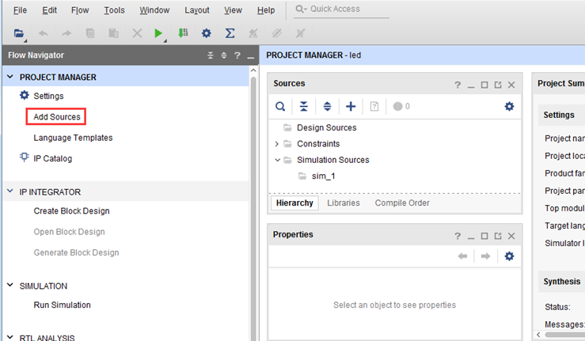

# FPGA 3_Vivado工程创建

## 1. 创建工程

<font color=LightGreen>1. 启动 Vivado</font>

<font color=LightGreen>2. 在 Vivado 开发环境里点击`Create New Project`，创建一个新的工程</font>


<font color=LightGreen>3. 弹出一个建立新工程的向导，点击`Next`</font>


<font color=LightGreen>4. 在弹出的对话框中输入工程名和工程存放的目录</font>

<font color=LightGreen>5. 在工程类型中选择`RTL Project`</font>


<font color=LightGreen>6. 目标语言`Target language`选择`Verilog`</font>


虽然选择 Verilog，但 VHDL 也可以使用，支持多语言混合编程。

<font color=LightGreen>7. 点击`Next`，不添加任何文件</font>


<font color=LightGreen>8. 选择器件型号</font>

## 2. 创建verilog文件

<font color=LightGreen>1. 点击 `Project Manager` 下的 `Add Sources` 图标</font>



<font color=LightGreen>2. 选择添加或创建设计源文件`Add or create design sources`，点击`Next`</font>


<font color=LightGreen>3. 选择创建文件`Create File`</font>


<font color=LightGreen>4. 设置文件名`File name`，完成添加</font>

## 3. 添加管脚约束

Vivado 使用的约束文件格式为 `xdc` 文件。`xdc` 文件里主要是完成管脚的约束,时钟的约束,  以及组的约束。

<font color=LightGreen>1. 点击`Open Elaborated Design`，在弹出的窗口中点击OK</font>


<font color=LightGreen>2. 在菜单中选择`Window -> I/O Ports`，在弹出的 `I/O Ports` 中可以看到管脚分配情况</font>


<font color=LightGreen>3. 分配引脚和电平标准，上下拉模式</font>

普通 IO 口只需约束引脚号和电压。

```xdc
set_property PACKAGE_PIN "引脚编号" [get_ports “端口名称”] 
set_property IOSTANDARD "电平标准" [get_ports “端口名称”]
```

Vivado 默认要求为所有 IO 分配正确的电平标准和管脚编号。

<font color=LightGreen>4. 保存约束文件</font>

## 4. 综合

综合是把输入设计以及约束条件翻译成 FPGA 内部逻辑资源（逻辑单元、RAM 存储单元、时钟单元等）按照某种连接方式组成的逻辑电路连接，生成网表文件。

点击流程向导中的`Run Synthesis`开始综合电路文件。

## 5. 布局布线

点击流程向导中的`Run Implementation`开始进行布局布线，实现电路文件。在随后弹出的对话框中点击“OK”以多线程启动实现工作。实现是将综合生成的网表文件翻译成所选器件的内部资源和硬件单元，找到硬件资源对应关系，进行布局布线，把电路固化到 FPGA。

## 6. 生成 BIT 流文件

<font color=LightGreen>1. 等待布局布线结束后，点击流程向导的`Generate Bitstream`开始生成比特流文件。</font>

<font color=LightGreen>2. 在弹出的对话框中可以选择任务数量，这里和 CPU 核心数有关，一般数字越大，编译越快，点击OK</font>

## 7. 下载代码

完成 Bitstream 文件生成之后即可进行下载验证。

<font color=LightGreen>1. 连接好开发板的 JTAG 接口，给开发板上电</font>

<font color=LightGreen>2. 在`HARDWARE MANAGER`界面点击`Auto Connect`，自动连接设备</font>


